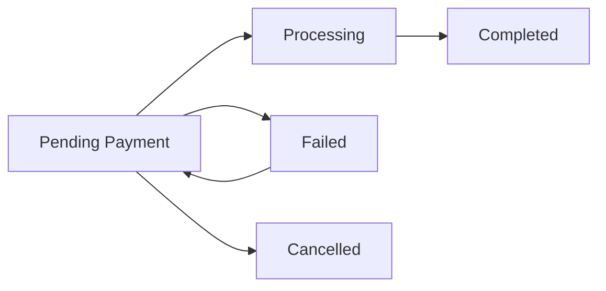

The order management system handles automatic status updates based on payment responses, triggers email notifications, and performs cleanup actions after payment processing.

## Overview

Order management in the WooCommerce Azul Payment Gateway is fully automated. Once a payment response is received from Azul, the system updates order status, records transaction details, and notifies both customers and administrators.

<Info>
Order management operations occur throughout the response handling process, primarily in `AzulPaymentGateway.php:307-342`.
</Info>

## Order status lifecycle

The gateway manages orders through several status transitions based on payment outcomes:



<Steps>
  <Step title="Pending payment">
    When a customer initiates checkout, WooCommerce creates an order with pending payment status. The order awaits response from Azul.
  </Step>

  <Step title="Processing or failed">
    Based on Azul's response, the order moves to either processing/completed (for approved payments) or failed (for declined payments).
  </Step>

  <Step title="Completed">
    Successful payments result in completed orders, triggering email notifications and cart clearing.
  </Step>
</Steps>

## Automatic status updates

The system automatically updates order status based on payment validation results:

### Completed orders

When a payment is approved and passes all validation checks:

```php
$order->update_status('completed', 
  sprintf(__('%s Pago completado! Numero de tarjeta: <b>'. $CardNumber . '</b>Codigo Autorizacion: <b>' . $AuthorizationCode . '</b> Numero de Referencia: <b>'. $RRN.'</b>', 'woocommerce'), 
  $order->title, $paymentId)
);
```

**Status:** `completed`

**Order note includes:**
- Masked card number (last 4 digits)
- Authorization code from Azul
- Retrieval Reference Number (RRN)

<Accordion title="Example completed order note">
  ```
  Pago completado! 
  Numero de tarjeta: **************1234
  Codigo Autorizacion: 123456
  Numero de Referencia: 987654321012
  ```
  
  This information helps administrators:
  - Verify the transaction in Azul's system
  - Resolve customer disputes
  - Track payment details for reconciliation
</Accordion>

### Failed orders - Transaction not approved

When Azul declines the payment:

```php
if($ResponseMessage != "APROBADA") {
  $order->update_status('failed', 
    sprintf(__('%s Pago fallido, Transaccion no aprobada. Numero de tarjeta: '. $CardNumber, 'woocommerce'), 
    $order->title, $paymentId)
  );
  return;
}
```

**Status:** `failed`

**Order note includes:**
- Failure message
- Masked card number used for the attempt

<Note>
Failed orders remain in the system, allowing customers to retry payment with a different card or payment method.
</Note>

### Failed orders - Amount inconsistency

When the payment amount doesn't match the order total:

```php
if($Cost != $oCost) {
  $order->update_status('failed', 
    sprintf(__('%s Pago fallido, Inconsistencia en valores, Numero de tarjeta: '. $CardNumber, 'woocommerce'), 
    $order->title, $paymentId)
  );
  return;
}
```

**Status:** `failed`

**Order note includes:**
- Amount inconsistency warning
- Card number used for the transaction

<Warning>
Amount inconsistencies may indicate:
- Cart modifications during checkout
- Response tampering attempts
- Currency conversion issues
- System synchronization problems

Investigate these cases immediately to ensure security and data integrity.
</Warning>

### Cancelled orders

When customers cancel payment on Azul's page:

```php
if($wooazul == 'cancel') {
  $order = new WC_Order($OrderNumber);
  $order->update_status('cancelled', 
    sprintf(__('%s payment cancelled! Transaction ID: %d', 'woocommerce'), 
    $this->title, $paymentId)
  );
}
```

**Status:** `cancelled`

**Order note includes:**
- Cancellation confirmation
- Transaction ID reference

## Order status validation

Before processing any payment response, the system validates the current order status to prevent duplicate processing:

```php
$order = new WC_Order($OrderNumber);
$paymentId = $order->get_transaction_id();

if($order->has_status('completed') || $order->has_status('processing')) {
  return;
}
```

<Accordion title="Why status checking matters">
  Status checking prevents:
  
  **Duplicate email notifications**
  - Customers receive only one confirmation email
  - Administrators don't get multiple notifications
  
  **Cart clearing issues**
  - Cart is emptied only once
  - Prevents loss of new items added after payment
  
  **Order note duplication**
  - Transaction details recorded once
  - Order history remains clean and accurate
  
  **Database conflicts**
  - Prevents race conditions
  - Ensures data integrity
</Accordion>

## Email notifications

The system triggers WooCommerce's email notification system for completed orders:

```php
$woocommerce->cart->empty_cart();
$email_class = 'WC_Email_Customer_Completed_Order';
```

While the email class is referenced, WooCommerce automatically handles email sending when order status changes to `completed`.

### Email types triggered

<Steps>
  <Step title="Customer completed order email">
    **Recipient:** Customer
    
    **Content:**
    - Order confirmation
    - Order details and items
    - Payment confirmation
    - Download links (for digital products)
    
    **Triggered by:** Status change to `completed`
  </Step>

  <Step title="Admin new order email">
    **Recipient:** Store administrator
    
    **Content:**
    - New order notification
    - Customer details
    - Order summary
    - Payment method used
    
    **Triggered by:** Order creation
  </Step>

  <Step title="Failed order email (optional)">
    **Recipient:** Store administrator
    
    **Content:**
    - Failed payment notification
    - Failure reason
    - Customer information
    
    **Triggered by:** Status change to `failed` (if enabled in WooCommerce settings)
  </Step>
</Steps>

<Info>
Email templates can be customized in **WooCommerce > Settings > Emails**. You can modify templates, enable/disable specific emails, and configure recipients.
</Info>

## Cart management

The system automatically clears the customer's cart after successful payment:

```php
$woocommerce->cart->empty_cart();
```

### Why cart clearing matters

<Accordion title="Prevents duplicate orders">
  Clearing the cart after payment prevents customers from accidentally placing the same order twice if they:
  - Navigate back to the cart page
  - Refresh the checkout page
  - Click the checkout button again
</Accordion>

<Accordion title="Improves user experience">
  An empty cart signals to customers that:
  - Their order was successfully placed
  - Payment was processed
  - They can start a new shopping session
</Accordion>

<Accordion title="Maintains accurate inventory">
  Cart clearing ensures:
  - Items are reserved only once
  - Inventory counts remain accurate
  - Stock management functions properly
</Accordion>

<Warning>
The cart is cleared **only** when payment is approved. Failed or cancelled payments preserve the cart, allowing customers to retry checkout or modify their order.
</Warning>

## Order notes and transaction logging

Each status update includes detailed order notes for tracking and debugging:

### Transaction information stored

| Data Point | Variable | Purpose |
|------------|----------|----------|
| Card number (masked) | `$CardNumber` | Identify payment method used |
| Authorization code | `$AuthorizationCode` | Verify transaction with Azul |
| Reference number | `$RRN` | Track transaction across systems |
| Payment amount | `$Cost` | Verify payment total |
| Response message | `$ResponseMessage` | Understand payment outcome |
| Response code | `$ResponseCode` | Detailed status code |
| Transaction date/time | `$DateTime` | Timestamp for reconciliation |

### Accessing order notes

Administrators can view order notes in the WooCommerce order edit screen:

1. Navigate to **WooCommerce > Orders**
2. Click on an order
3. Scroll to the **Order notes** section
4. View all payment-related updates and transaction details

<Info>
Order notes are visible only to administrators and are not shown to customers on the order details page.
</Info>

## Post-payment redirect

After successful payment processing, the system redirects customers to the site homepage:

```php
return array(
  'result' => 'success',
  'redirect' => get_site_url()
);
```

<Note>
**Customization opportunity:** You can modify the redirect URL to send customers to:
- A custom thank you page
- The order received page
- A post-purchase survey
- A related products page

Simply change `get_site_url()` to your desired URL.
</Note>

## Order metadata

The system leverages WooCommerce's order metadata to store additional transaction information:

```php
$order = new WC_Order($OrderNumber);
$paymentId = $order->get_transaction_id();
```

While the current implementation retrieves the transaction ID, you can extend the system to store additional metadata:

```php
// Example: Store Azul-specific metadata
$order->update_meta_data('_azul_authorization_code', $AuthorizationCode);
$order->update_meta_data('_azul_rrn', $RRN);
$order->update_meta_data('_azul_response_code', $ResponseCode);
$order->save();
```

## Error recovery

The order management system includes built-in error recovery mechanisms:

### Automatic retry opportunity

Failed orders remain accessible to customers:

1. Customer receives failed payment notification
2. Order status is set to `failed` (not deleted)
3. Customer can access **My Account > Orders**
4. Customer can click "Pay" to retry with a different payment method

### Manual intervention

Administrators can manually manage orders:

1. **Change order status** - Override automatic status if needed
2. **Add manual notes** - Document special circumstances
3. **Process refunds** - Handle returns and cancellations
4. **Resend emails** - Trigger notifications manually

## Best practices

<Steps>
  <Step title="Monitor failed orders">
    Regularly review failed orders to identify:
    - Common decline reasons
    - Payment gateway issues
    - Customer payment problems
    - Potential fraud attempts
  </Step>

  <Step title="Customize email templates">
    Personalize email notifications to:
    - Match your brand identity
    - Include helpful information
    - Improve customer experience
    - Reduce support inquiries
  </Step>

  <Step title="Implement order notes">
    Use order notes to:
    - Document all payment attempts
    - Record customer communications
    - Track special circumstances
    - Aid in dispute resolution
  </Step>

  <Step title="Configure status webhooks">
    Set up webhooks or integrations to:
    - Notify fulfillment systems
    - Update inventory management
    - Trigger marketing automation
    - Sync with accounting software
  </Step>

  <Step title="Test status transitions">
    Regularly test all order status scenarios:
    - Approved payments
    - Declined payments
    - Cancelled payments
    - Amount mismatches
  </Step>
</Steps>

## Integration with WooCommerce

The gateway fully integrates with WooCommerce's order management system:

### Native WooCommerce features supported

- **Order statuses** - Uses standard WooCommerce order statuses
- **Email notifications** - Triggers built-in email system
- **Order notes** - Adds notes to WooCommerce order history
- **Transaction IDs** - Stores payment IDs in order metadata
- **Cart management** - Uses WooCommerce cart functions
- **Customer accounts** - Links orders to customer profiles

### Administrative actions available

- View all orders in **WooCommerce > Orders**
- Filter orders by payment method
- Export order data for reporting
- Generate financial reports
- Process refunds (manual)
- Edit order details as needed

## Troubleshooting order issues

<Accordion title="Orders stuck in pending status">
  **Cause:** Response from Azul not received or processed
  
  **Solution:**
  - Check if the response URL is accessible
  - Verify that the `OrderNumber` parameter is being passed
  - Review server logs for errors
  - Manually update order status after verifying payment in Azul's dashboard
</Accordion>

<Accordion title="Duplicate order emails">
  **Cause:** Response processed multiple times
  
  **Solution:**
  - Ensure status checking is functioning (`has_status` check)
  - Verify that Azul is not sending duplicate callbacks
  - Check for caching issues preventing status updates
</Accordion>

<Accordion title="Cart not clearing after payment">
  **Cause:** Cart clearing code not executing
  
  **Solution:**
  - Verify payment status is `completed`
  - Check for PHP errors in error logs
  - Ensure `$woocommerce->cart->empty_cart()` is executing
  - Test with WooCommerce debug mode enabled
</Accordion>

<Accordion title="Missing transaction details in order notes">
  **Cause:** Response parameters not captured correctly
  
  **Solution:**
  - Verify all GET parameters are being received
  - Check URL structure and parameter names
  - Enable debug logging to capture response data
  - Compare with Azul's documented response format
</Accordion>

## Related pages

<CardGroup cols={2}>
  <Card title="Payment processing" icon="credit-card" href="/features/payment-processing">
    Learn how payments are initiated and submitted
  </Card>
  <Card title="Response handling" icon="webhook" href="/features/response-handling">
    Understand how payment responses are validated
  </Card>
</CardGroup>