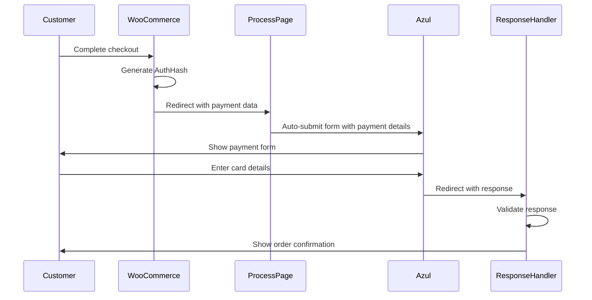

## Overview

The Azul payment integration follows a redirect-based flow where customers are sent to Azul's secure payment page, complete their transaction, and are redirected back to your site with the payment result.

## Flow diagram



## Step-by-step flow

<Steps>

<Step title="Customer initiates checkout">
The customer selects Azul as their payment method and clicks the "Place Order" button in WooCommerce.

```php
// WooCommerce triggers the process_payment method
public function process_payment( $order_id ) {
    global $woocommerce;
    $order = new WC_Order( $order_id );
    // Payment processing begins...
}
```
</Step>

<Step title="Generate payment parameters">
The gateway prepares all required payment parameters including the AuthHash.

See `AzulPaymentGateway.php:162-213`:

```php
// Set basic parameters
$OrderNumber = $order_id;
$this->currencyCode = "$";
$this->useCustomField1 = "1";
$this->customFieldLabel = "orderId";
$this->customFieldValue = $OrderNumber;
$this->useCustomField2 = "0";

// Format amounts
$this->itbis = number_format($order->get_total_tax(), 2); 
$this->itbis = str_replace(".", "", $this->itbis);
$this->itbis = str_replace(",", "", $this->itbis);

$this->cost = number_format($order->get_total(), 2); 
$this->cost = str_replace(".", "", $this->cost);
$this->cost = str_replace(",", "", $this->cost);

// Set response URLs
$this->approvedUrl = $this->get_option('approvedUrl');
$this->declinedUrl = $this->get_option('declinedUrl');
$this->cancelUrl = $this->get_option('cancelUrl');

// Generate authentication hash
$this->authHash = hash('sha512', 
    $this->merchantId . 
    $this->merchantName . 
    $this->merchantType . 
    $this->currencyCode .
    $OrderNumber . 
    $this->cost . 
    $this->itbis . 
    $this->approvedUrl . 
    $this->declinedUrl . 
    $this->cancelUrl . 
    $this->approvedUrl .
    $this->useCustomField1 . 
    $this->customFieldLabel . 
    $this->customFieldValue . 
    $this->useCustomField2 . 
    $this->authKey
);
```
</Step>

<Step title="Redirect to process page">
The gateway redirects the customer to your process page with all payment data as URL parameters.

```php
// Build hidden fields array
$hidden_fields = array(
    'MerchantId' => $this->merchantId,
    'MerchantName' => $this->merchantName,
    'MerchantType' => $this->merchantType,
    'CurrencyCode' => $this->currencyCode,
    'itbis' => $this->itbis,
    'OrderNumber' => $OrderNumber,
    'Amount' => $this->cost,
    'ApprovedUrl' => $this->approvedUrl,
    'DeclinedUrl' => $this->declinedUrl,
    'CancelUrl' => $this->cancelUrl,
    'ResponsePostUrl' => $this->approvedUrl,
    'UseCustomField1' => $this->useCustomField1,
    'CustomField1Label' => $this->customFieldLabel,
    'CustomField1Value' => $this->customFieldValue,
    'UseCustomField2' => $this->useCustomField2,
    'AuthHash' => $this->authHash,
    'ShowTransactionResult' => 0,
    'AzulUrl' => $this->azulUrl
);

// Redirect to process page
if($this->cost != 0) {
    return array(
        'result' => 'success',
        'redirect' => $this->processUrl . '?' . http_build_query($hidden_fields)
    );
}
```
</Step>

<Step title="Process page auto-submits to Azul">
The process page (WordPress template) extracts parameters from the URL and creates an auto-submitting form to Azul.

See `azulWooProcessPayment.php:1-97`:

```php
<?php
/* Template Name: Azul - WooCommerce Process*/

// Extract all GET parameters
if(isset($_GET['AzulUrl'])) {
    $AzulUrl = $_GET['AzulUrl'];
}
if(isset($_GET['MerchantId'])) {
    $MerchantId = $_GET['MerchantId'];
}
// ... (extract all other parameters)

// Create auto-submitting form
$form = '
    <form id="orderForm" method="POST" action="'. $AzulUrl .'">
        <input type="hidden" name="MerchantId" value="'. $MerchantId .'">
        <input type="hidden" name="MerchantName" value="'. $MerchantName .'">
        <input type="hidden" name="MerchantType" value="'. $MerchantType .'">
        <input type="hidden" name="CurrencyCode" value="'. $CurrencyCode .'">
        <input type="hidden" name="itbis" value="'. $itbis .'">
        <input type="hidden" name="OrderNumber" value="'. $OrderNumber .'">
        <input type="hidden" name="Amount" value="'. $Amount .'">
        <input type="hidden" name="ApprovedUrl" value="'. $ApprovedUrl .'">
        <input type="hidden" name="DeclinedUrl" value="'. $DeclinedUrl .'">
        <input type="hidden" name="CancelUrl" value="'. $CancelUrl .'">
        <input type="hidden" name="ResponsePostUrl" value="'. $ResponsePostUrl .'">
        <input type="hidden" name="UseCustomField1" value="'. $UseCustomField1 .'">
        <input type="hidden" name="CustomField1Label" value="'. $CustomField1Label .'">
        <input type="hidden" name="CustomField1Value" value="'. $CustomField1Value .'">
        <input type="hidden" name="UseCustomField2" value="'. $UseCustomField2 .'">
        <input type="hidden" name="AuthHash" value="'. $AuthHash .'">
    </form>
';

echo $form;

// Auto-submit the form
echo '<script>
    document.getElementById("orderForm").submit();
</script>';
?>
```
</Step>

<Step title="Customer completes payment on Azul">
The customer is now on Azul's secure payment page where they:

1. Enter their card details
2. Review the transaction amount
3. Confirm the payment

The Azul URL differs based on environment:

```php
public function get_return_url( $order ) {
    if ( $this->testmode ) {
        $this->azulUrl = 'https://pruebas.azul.com.do/PaymentPage/default.aspx';
    } else {
        $this->azulUrl = 'https://pagos.azul.com.do/PaymentPage/default.aspx';
    }
    return parent::get_return_url( $order );
}
```

<Tabs>
<Tab title="Production">
**URL**: `https://pagos.azul.com.do/PaymentPage/default.aspx`

Use this URL for live transactions with real payment credentials.
</Tab>

<Tab title="Sandbox">
**URL**: `https://pruebas.azul.com.do/PaymentPage/default.aspx`

Use this URL for testing with sandbox credentials.
</Tab>
</Tabs>

</Step>

<Step title="Azul redirects back with response">
After processing the payment, Azul redirects the customer to one of your configured URLs based on the result:

- **ApprovedUrl**: Payment was approved
- **DeclinedUrl**: Payment was declined
- **CancelUrl**: Customer cancelled the transaction
- **ResponsePostUrl**: Receives the payment response data

The response includes multiple parameters in the URL query string.
</Step>

<Step title="Response validation and order update">
Your site receives the response and validates it before updating the order status.

See `AzulPaymentGateway.php:243-344` for the complete response handler.
</Step>

</Steps>

## Response URLs configuration

All response URLs are configured in the gateway settings and must be set up before accepting payments.

### URL parameters

<Tabs>
<Tab title="ApprovedUrl">
```php
'approvedUrl' => array(
    'title' => __('Pagina de aprobacion', 'woo_azul'),
    'type' => 'text',
    'description' => __('Direccion de la pagina de aprobación', 'woo_azul'),
    'default' => get_site_url()
)
```

This URL receives approved payment responses. Typically points to your order completion page.

**Example**: `https://yoursite.com/order-complete/`
</Tab>

<Tab title="DeclinedUrl">
```php
'declinedUrl' => array(
    'title' => __('Pagina de declinacion', 'woo_azul'),
    'type' => 'text',
    'description' => __('Direccion de la pagina de declinación', 'woo_azul'),
    'default' => get_site_url()
)
```

This URL receives declined payment responses. Should inform the customer their payment was not approved.

**Example**: `https://yoursite.com/payment-declined/`
</Tab>

<Tab title="CancelUrl">
```php
'cancelUrl' => array(
    'title' => __('Pagina de cancelacion', 'woo_azul'),
    'type' => 'text',
    'description' => __('Direccion de la pagina de cancelación', 'woo_azul'),
    'default' => get_site_url()
)
```

This URL is used when customers cancel the transaction on Azul's page.

**Example**: `https://yoursite.com/checkout/`
</Tab>

<Tab title="ProcessUrl">
```php
'processUrl' => array(
    'title' => __('Process Page Azul', 'woo_azul'),
    'type' => 'text',
    'description' => __('Direccion de la pagina de preparación', 'woo_azul'),
    'default' => get_site_url()
)
```

This is your intermediate page that auto-submits the payment form to Azul. Must be a WordPress page using the `azulWooProcessPayment.php` template.

**Example**: `https://yoursite.com/azul-process/`
</Tab>
</Tabs>

<Warning>
All URLs must use HTTPS in production to ensure secure data transmission.
</Warning>

## Payment parameters sent to Azul

Here's the complete list of parameters sent to Azul's payment page:

| Parameter | Type | Description | Example |
|-----------|------|-------------|--------|
| MerchantId | string | Your merchant ID from Azul | "39038540035" |
| MerchantName | string | Your business name | "Mi Tienda Online" |
| MerchantType | string | Type of business | "Comercio electronico" |
| CurrencyCode | string | Currency symbol | "$" |
| OrderNumber | integer | WooCommerce order ID | 1234 |
| Amount | string | Total amount (no decimals) | "10099" (for $100.99) |
| itbis | string | Tax amount (no decimals) | "1818" (for $18.18) |
| ApprovedUrl | string | Success redirect URL | "https://site.com/approved" |
| DeclinedUrl | string | Declined redirect URL | "https://site.com/declined" |
| CancelUrl | string | Cancel redirect URL | "https://site.com/cancelled" |
| ResponsePostUrl | string | Response handler URL | "https://site.com/approved" |
| UseCustomField1 | string | Enable custom field 1 | "1" |
| CustomField1Label | string | Custom field label | "orderId" |
| CustomField1Value | string | Custom field value | "1234" |
| UseCustomField2 | string | Enable custom field 2 | "0" |
| AuthHash | string | SHA-512 authentication hash | "a1b2c3..." |
| ShowTransactionResult | integer | Show result on Azul page | 0 |

## Testing the payment flow

<Steps>

<Step title="Enable sandbox mode">
Go to **WooCommerce** > **Settings** > **Payments** > **Azul** and enable sandbox mode.
</Step>

<Step title="Configure sandbox credentials">
Use test credentials provided by Azul for the sandbox environment.
</Step>

<Step title="Set up response URLs">
Ensure all URLs point to accessible pages on your site.
</Step>

<Step title="Create a test order">
Add products to cart and proceed through checkout selecting Azul as payment method.
</Step>

<Step title="Complete test payment">
Use Azul's test card numbers to simulate approved, declined, or error scenarios.
</Step>

<Step title="Verify order status">
Check that the order status is updated correctly in WooCommerce admin.
</Step>

</Steps>

<Info>
In sandbox mode, you can test different payment scenarios without processing real transactions.
</Info>

## Troubleshooting

### Customer not redirected to Azul

**Possible causes**:
- Process URL not configured correctly
- WordPress template not found
- JavaScript disabled in browser

**Solution**: Verify the process page uses the correct template and is accessible.

### Payment approved but order not updated

**Possible causes**:
- Response URL not configured
- Response validation failing
- PHP errors in checkResponse function

**Solution**: Enable debug logging and check for errors in the response handler.

### Amount mismatch errors

**Possible causes**:
- Incorrect amount formatting
- Currency conversion issues

**Solution**: Verify amounts are formatted as integers without decimal points.

## Next steps

<CardGroup cols={2}>
<Card title="Callbacks" icon="webhook" href="/integration/callbacks">
Learn how to handle and validate payment responses from Azul
</Card>

<Card title="Response codes" icon="list-check" href="/reference/response-codes">
View all possible response codes and their meanings
</Card>
</CardGroup>